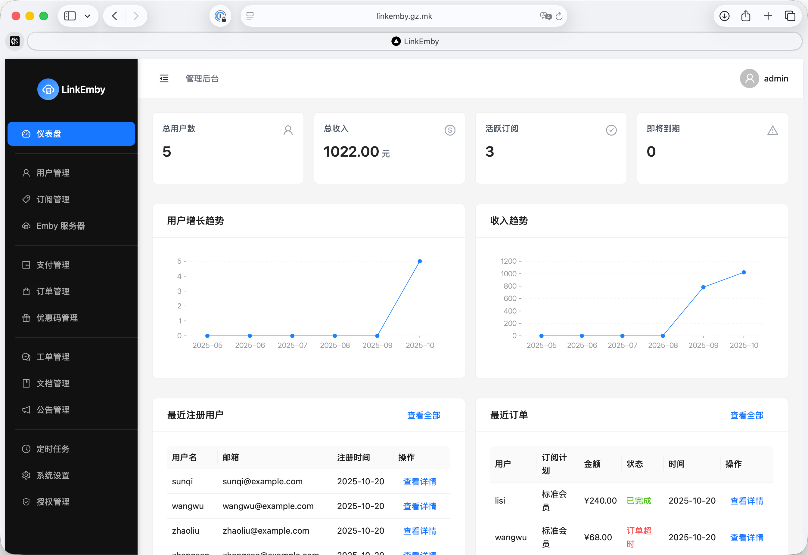

<div align="center">

# LinkEmby

**🎯 专业的 Emby 订阅管理系统**

基于 Next.js 打造 · 用户门户 + 管理后台双界面架构 · 高效管理订阅、用户与运维流程



[](https://t.me/berlin_lab)
[](https://www.docker.com/)
[](https://www.postgresql.org/)
[](https://nextjs.org/)

[在线体验](#-在线体验) · [快速开始](#-快速开始) · [核心功能](#-核心功能) · [系统要求](#-系统要求) · [联系我们](#-联系我们)

</div>

---

## 🎯 在线体验

**体验地址**: [https://linkemby.gz.mk](https://linkemby.gz.mk)

**默认账号**:
- 用户名: `admin`
- 密码: `password123`

> 💡 体验环境仅供测试使用，请勿存储重要数据。数据可能会被定期重置。

---

## 📞 联系我们

<table>
<tr>
<td width="120"><b>🔹 TG 频道</b></td>
<td><a href="https://t.me/linkemby">@linkemby</a></td>
</tr>
<tr>
<td width="120"><b>🔹 TG 群组</b></td>
<td><a href="https://t.me/linkemby_chat">@linkemby_chat</a></td>
</tr>
<tr>
<td><b>🔹 邮箱</b></td>
<td>umbras.hallows.0p@icloud.com</td>
</tr>
<tr>
<td><b>🔹 微信</b></td>
<td>berlin_lab</td>
</tr>
</table>

💡 **如需购买授权许可或获取技术支持，欢迎随时联系！**

---

## ✨ 核心功能

<table>
<tr>
<td width="50%" valign="top">

### 🖥️ Emby 服务器管理

- ✅ **多服务器编排** - 集中管理多台 Emby 服务器
- 🔄 **差异对比** - 一键对比服务器用户与系统用户差异
- 📥 **快速导入** - 批量导入 Emby 服务器现有用户
- 💚 **健康监控** - 实时监控服务器运行状态

</td>
<td width="50%" valign="top">

### 📅 订阅管理

- 🎁 **灵活计划** - 支持试用 / 日 / 月 / 季 / 年等多种订阅
- 🌐 **多服务器关联** - 订阅可关联多个 Emby 服务器
- 🤖 **自动化开通** - 购买后自动创建账号、同步密码与权限
- ⏰ **到期管理** - 订阅过期自动禁用所有关联账户

</td>
</tr>
<tr>
<td width="50%" valign="top">

### 👥 用户管理

- 📥 **批量导入** - 支持 CSV 导入或从 Emby 服务器导入
- ⚡ **批量操作** - 批量删除账号、分配订阅
- 🔐 **自助服务** - 用户自助注册、找回密码
- 📊 **用户画像** - 完整的用户数据与行为分析

</td>
<td width="50%" valign="top">

### 💳 支付管理

- 💰 **易支付集成** - 支持支付宝 / 微信支付
- 📊 **订单追踪** - 完整的订单流转与收入统计
- 🛒 **自助购买** - 用户自助下单、续费
- 🎟️ **优惠券** - 支持优惠券创建、使用范围与统计

</td>
</tr>
<tr>
<td width="50%" valign="top">

### 📧 邮件通知

- ⚙️ **SMTP 配置** - 灵活配置邮件服务器
- ✉️ **账户验证** - 注册、找回密码邮箱验证
- 🔔 **到期提醒** - 自动发送续费与到期通知
- 📨 **批量通知** - 支持批量发送营销邮件(comming soon)

</td>
<td width="50%" valign="top">

### 🛠️ 运营工具

- 📚 **文档中心** - 编写教程文档指导用户使用
- 📢 **公告系统** - 发布重要公告与系统通知
- 🎫 **工单系统** - 完整的工单提交与处理流程
- 📊 **数据统计** - 全面的运营数据与分析报表

</td>
</tr>
<tr>
<td width="50%" valign="top">

### 🎟️ 卡密系统

- 🎁 **双类型卡密** - 支持余额充值卡与订阅激活卡
- 📦 **批量生成** - 一键批量生成卡密，支持自定义前缀和标签
- 🔐 **安全兑换** - 用户自助兑换，自动验证和激活
- 📈 **使用统计** - 实时追踪卡密使用情况和兑换历史

</td>
<td width="50%" valign="top">

### 🎬 点播功能

- 🔍 **TMDB 集成** - 对接 TMDB API，海量影视资源检索
- 📺 **影视点播** - 支持电影和电视剧点播请求
- 🎯 **配额控制** - 基于订阅计划的点播配额管理（日/周/月）
- 🔄 **状态追踪** - 完整的审批流程和状态管理

</td>
</tr>
</table>

### 🚧 开发计划

<details>
<summary>点击查看即将推出的功能</summary>

- 📺 **入库通知** - 对接 Emby Webhook，实时展示最新入库影片
- 📱 **移动端适配** - 优化移动端体验，支持响应式布局
- 🌐 **多语言支持** - 支持中英文切换，方便国际用户使用

</details>

---

## 🚀 快速开始

### 一键安装

```bash
curl -fsSL https://raw.githubusercontent.com/linkemby/linkemby-deploy/main/install.sh | bash
```

<details>
<summary>🌏 国内用户加速（点击展开）</summary>

```bash
curl -fsSL "https://ghfast.top/https://raw.githubusercontent.com/linkemby/linkemby-deploy/main/install.sh" | bash
```

</details>

<details>
<summary>📋 安装脚本将自动完成以下操作（点击展开）</summary>

- ✅ 检测系统环境（Docker、Docker Compose）
- ✅ 下载所需的配置文件
- ✅ 自动生成安全密钥
- ✅ 交互式配置访问 URL、端口等参数
- ✅ 缓存安装路径到 `~/.linkemby`
- ✅ 拉取 Docker 镜像
- ✅ 启动所有服务

</details>

### 升级

重新运行安装脚本即可升级：

```bash
curl -fsSL https://raw.githubusercontent.com/linkemby/linkemby-deploy/main/install.sh | bash
```

<details>
<summary>🌏 国内用户加速（点击展开）</summary>

```bash
curl -fsSL "https://ghfast.top/https://raw.githubusercontent.com/linkemby/linkemby-deploy/main/install.sh" | bash
```

</details>

<details>
<summary>📋 升级过程说明（点击展开）</summary>

- ✅ 交互式重新配置访问地址和端口（覆盖现有配置）
- ✅ 保留所有安全密钥和数据库密码
- ✅ 更新 `docker-compose.yml`
- ✅ 拉取最新的 Docker 镜像
- ✅ 重启服务

</details>

### 卸载

运行卸载脚本：

```bash
curl -fsSL https://raw.githubusercontent.com/linkemby/linkemby-deploy/main/uninstall.sh | bash
```

<details>
<summary>🌏 国内用户加速（点击展开）</summary>

```bash
curl -fsSL "https://ghfast.top/https://raw.githubusercontent.com/linkemby/linkemby-deploy/main/uninstall.sh" | bash
```

</details>

<details>
<summary>📋 卸载选项说明（点击展开）</summary>

卸载脚本提供三种卸载选项：

1. **仅停止服务** - 保留所有数据和配置文件
2. **停止服务并删除数据** - 删除数据库、Redis 等数据，但保留配置文件
3. **完全卸载** - 删除所有文件、数据和缓存

> 💡 卸载脚本会自动从缓存读取安装目录，无需手动指定

</details>

---

## 📋 系统要求

- **操作系统**：Linux (Ubuntu 20.04+、Debian 11+、CentOS 8+)
- **Docker**：20.10+
- **Docker Compose**：2.0+（支持 `docker compose` 与 `docker-compose` 两种命令）
- **内存**：最低 2GB，推荐 4GB+
- **磁盘**：最低 10GB 可用空间

---

## 📦 包含的服务

| 服务           | 说明             | 默认端口 |
| ------------ | -------------- | ---- |
| **linkemby** | 主应用程序          | 3000 |
| **postgres** | PostgreSQL 数据库 | 5432 |
| **redis**    | Redis 缓存       | 6379 |
| **cron**     | 定时任务服务         | -    |

---

## 💡 免费使用限制

- 最多 **10 个用户**
- 最多 **1 个 Emby 服务器**

如需解除限制，请购买授权许可。联系方式见下方 [联系我们](#-联系我们) 部分。

---

## 🔧 手动安装

如果你倾向于手动部署，请按照以下步骤操作：

### 1. 创建安装目录

```bash
sudo mkdir -p /opt/linkemby
cd /opt/linkemby
```

### 2. 下载配置文件

```bash
# 下载 docker-compose.yml
curl -fsSL https://raw.githubusercontent.com/linkemby/linkemby-deploy/main/docker-compose.yml -o docker-compose.yml

# 下载 .env.example
curl -fsSL https://raw.githubusercontent.com/linkemby/linkemby-deploy/main/.env.example -o .env.example
```

### 3. 配置环境变量

```bash
cp .env.example .env
nano .env
```

**必须修改的配置项：**

```bash
# 数据库密码（必须修改）
POSTGRES_PASSWORD=your_secure_password_here

# 外部访问地址（必须修改为你的域名或 IP）
NEXTAUTH_URL=http://your-domain.com

# 安全密钥（必须生成）
NEXTAUTH_SECRET=$(openssl rand -base64 32)
ENCRYPTION_KEY=$(openssl rand -hex 16)
ENCRYPTION_IV=$(openssl rand -hex 8)
CRON_SECRET=$(openssl rand -base64 32)
```

### 4. 启动服务

```bash
docker compose up -d
```

### 5. 检查服务状态

```bash
docker compose ps
docker compose logs -f
```

---

## 📝 环境变量说明

### 数据库配置

| 变量                  | 说明            | 默认值      |
| ------------------- | ------------- | -------- |
| `POSTGRES_USER`     | 数据库用户名        | linkemby |
| `POSTGRES_PASSWORD` | 数据库密码         | 自动生成     |
| `POSTGRES_DB`       | 数据库名称         | linkemby |
| `POSTGRES_PORT`     | PostgreSQL 端口 | 5432     |

### Redis 配置

| 变量               | 说明       | 默认值  |
| ---------------- | -------- | ---- |
| `REDIS_PASSWORD` | Redis 密码 | 自动生成 |
| `REDIS_PORT`     | Redis 端口 | 6379 |

### 应用配置

| 变量              | 说明     | 示例                    |
| --------------- | ------ | --------------------- |
| `NEXTAUTH_URL`  | 外部访问地址 | http://localhost:3000 |
| `LINKEMBY_PORT` | 应用端口   | 3000                  |
| `NODE_ENV`      | 运行环境   | production            |

### 安全密钥（自动生成）

| 变量                | 说明          | 格式           |
| ----------------- | ----------- | ------------ |
| `NEXTAUTH_SECRET` | NextAuth 密钥 | Base64，32 字节 |
| `ENCRYPTION_KEY`  | 加密密钥        | Hex，32 字符    |
| `ENCRYPTION_IV`   | 加密向量        | Hex，16 字符    |
| `CRON_SECRET`     | 定时任务认证密钥    | Base64，32 字节 |

### 日志配置

| 变量              | 说明   | 可选值                   |
| --------------- | ---- | --------------------- |
| `LOG_LEVEL`     | 日志级别 | error、warn、info、debug |
| `LOG_TO_FILE`   | 写入文件 | true、false            |
| `LOG_FILE_PATH` | 日志路径 | /app/data/logs        |

---

## 🛠️ 常用命令

> 提示：以下命令使用 `docker compose` 格式（推荐）。如使用旧版本，请将 `docker compose` 替换为 `docker-compose`。

```bash
# 进入安装目录
cd /opt/linkemby

# 启动服务
docker compose up -d

# 停止服务
docker compose down

# 重启服务
docker compose restart

# 查看日志（所有服务）
docker compose logs -f

# 查看特定服务日志
docker compose logs -f linkemby

# 查看服务状态
docker compose ps

# 更新镜像并重启
docker compose pull
docker compose up -d
```

---

## 🔄 定时任务

| 任务        | 频率       | 说明              |
| --------- | -------- | --------------- |
| 订阅到期提醒    | 每天 09:00 | 提醒用户订阅即将到期      |
| 订阅状态同步    | 每天 00:30 | 同步 Emby 账号状态    |
| 取消未支付订单   | 每分钟      | 清理超时未支付订单       |
| 缓存清理      | 每天 02:00 | 清理过期缓存          |
| Emby 健康检查 | 每 5 分钟   | 检查 Emby 服务器健康状态 |

> 可选任务：如需启用“用户状态检查”，请在 `docker-compose.yml` 中取消注释 `CRON_JOB_USER_STATUS`，默认调度时间为每天 03:00。

---

## 🔍 故障排查

### 服务无法启动

```bash
# 检查 Docker 服务状态
sudo systemctl status docker

# 检查端口占用
sudo netstat -tulpn | grep -E '3000|5432|6379'

# 查看详细日志
docker compose logs --tail=100
```

### 数据库连接失败

```bash
# 检查数据库容器状态
docker compose ps postgres

# 检查数据库日志
docker compose logs postgres

# 测试数据库连接
docker compose exec postgres psql -U linkemby -d linkemby
```

### Redis 连接失败

```bash
# 检查 Redis 容器状态
docker compose ps redis

# 测试 Redis 连接
docker compose exec redis redis-cli ping
```

### 应用无法访问

```bash
# 检查应用健康状态
curl http://localhost:3000/api/health

# 检查应用日志
docker compose logs linkemby

# 检查防火墙设置
sudo ufw status
sudo firewall-cmd --list-all
```

---

## 💾 备份与恢复

### 备份

```bash
# 停止服务
cd /opt/linkemby
docker compose down

# 备份数据目录
sudo tar -czf linkemby-backup-$(date +%Y%m%d).tar.gz /opt/linkemby

# 重启服务
docker compose up -d
```

### 恢复

```bash
# 停止服务
cd /opt/linkemby
docker compose down

# 恢复数据
sudo tar -xzf linkemby-backup-YYYYMMDD.tar.gz -C /

# 重启服务
docker compose up -d
```

---

## 🔒 安全建议

1. 修改默认密码：务必更新 `POSTGRES_PASSWORD`
2. 使用 HTTPS：在生产环境中通过反向代理（Nginx / Caddy）配置 SSL
3. 防火墙配置：只开放必要端口（如 80、443）
4. 定期备份：设置自动备份任务
5. 更新镜像：定期运行升级脚本获取最新安全补丁

---

## ⚠️ 使用声明

- LinkEmby 仅用于合法管理自有或经授权的 Emby 服务器账户。
- 本项目不包含任何媒体资源，也不提供盗版内容或第三方资源获取渠道。
- 部署与使用者需遵守所在地法律法规，严禁将本项目用于任何违法或侵权行为。
